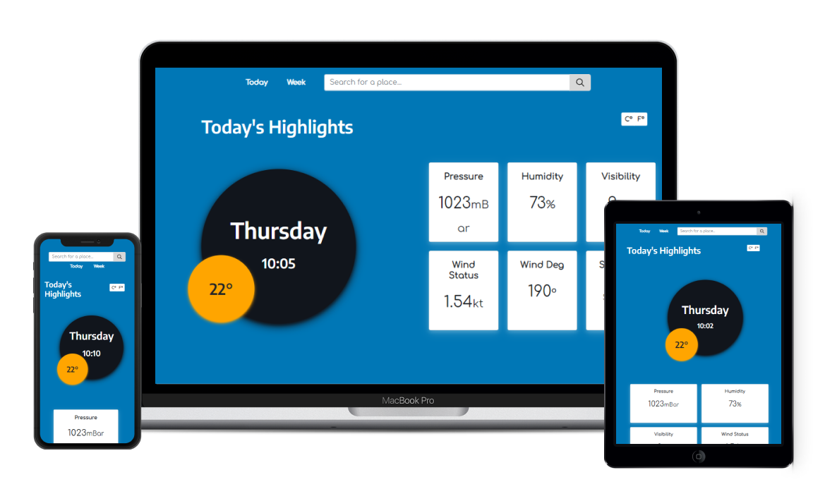

# Weathery built with React

A simple [Weather app](https://weathery-app.netlify.app/) 

Give a ⭐ if you like this website!

## Features
* Search functionality.
* Celsius to Fahrenheit (and vice versa) conversion.
* Get weather by coordinates.
* Get Today's and next week's weather info.
* Error page.

## Installation $ Setup
You can fork this repo to modify and make changes of your own. Please give me proper credit by linking back to [GitGud31](https://github.com/GitGud31). Thanks!

1. Installation: `npm install`
2. In the project directory, you can run: `npm start`
3. Open `http://localhost:3000` to view it in the browser.
4. If you want the full functionality you need to have an account at [OpenWeatherApi](https://openweathermap.org/)
5. Replace `API_KEY` with your own in the `fetch()` method inside `Home.jsx`.

## Suggest a feature
* [Feature request](https://github.com/GitGud31/public-react-portfolio/issues)
## Report a bug
* [Bug report](https://github.com/GitGud31/public-react-portfolio/issues)